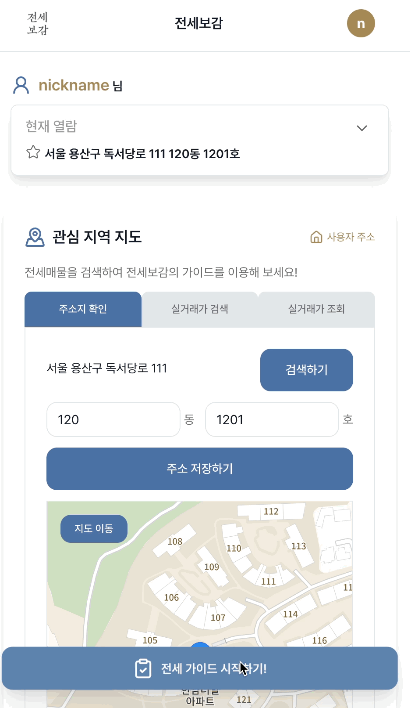
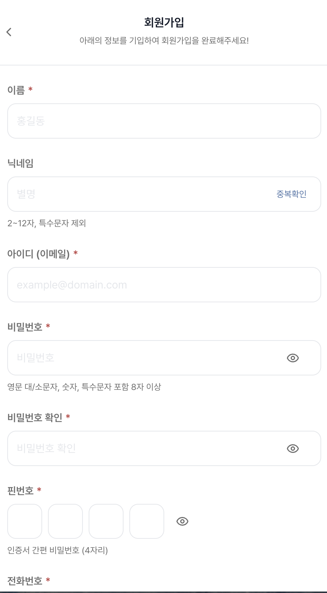
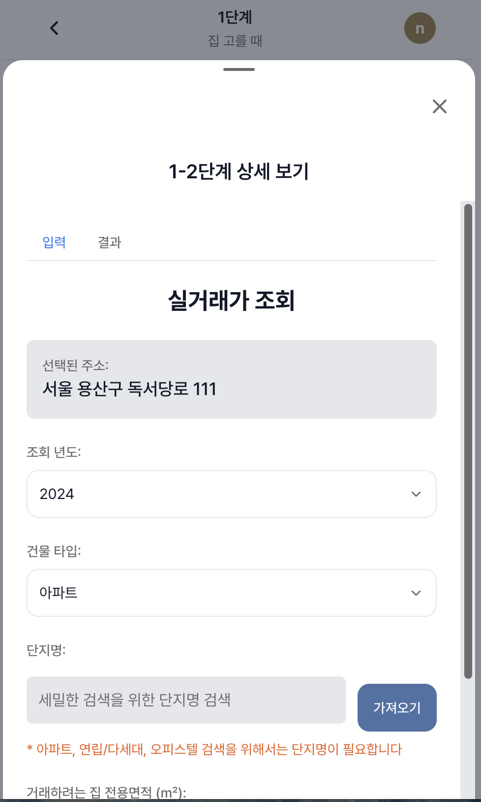
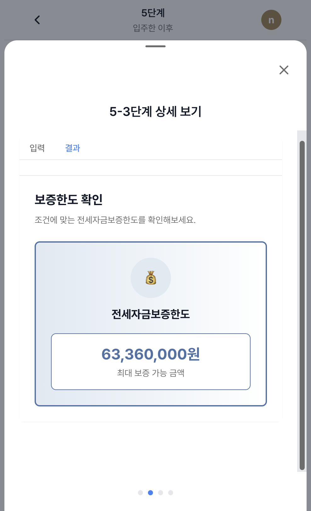

# **전세보감**

> ### 주요 서비스 : 전세 사기를 예방하는 다양한 방법을 가이드 하는 서비스<br>

### 🌱 전세사기 예방은, 전세보감! 🌳

전세 사기를 예방을 위한 3가지!

1. 필요한 정보를 "전세보감" 하나로
2. 복잡한 신청 방법도 "전세보감"
3. 어려운 단어나 복잡한 용어도 "전세보감"

<br>
<br>

### 🙋🙋‍♂️ 함께 만드는 사람들

| [조승연](https://github.com/layout-SY)                                          | [김지혜](https://github.com/Jihye-kr)                                           | [노석준](https://github.com/aiden0413)                                         | [임채원](https://github.com/icw0201)                                            |
| ------------------------------------------------------------------------------- | ------------------------------------------------------------------------------- | ------------------------------------------------------------------------------ | ------------------------------------------------------------------------------- |
|  |  |  |  |
| <p align="center">FE / BE</p>                                                   | <p align="center">FE</p>                                                        | <p align="center">FE / BE</p>                                                  | <p align="center">FE / BE</p>                                                   |

<br>

### 🗓 개발 기간

✨ 2025.08 - 2025.08

<br>

### 🍏 배포 주소

#### [전세보감]- https://lion5-bogam.site

<br>

### 🗒 프로젝트 자료

#### [전세보감 Note](https://www.notion.so/2-264cb05a2710807d8734e8edd4875d30)

<br>

### 💡 시작 가이드

<details>
<summary><strong>보기</strong></summary>
<div markdown="1">

#### 📍 실행 환경

- Node.js 20.18.1
- `.env 파일`에 아래의 항목들이 있어야 합니다.

  - `CODEF_DEMO_CLIENT_ID` : 외부 API(CODEF API) client id
  - `CODEF_DEMO_CLIENT_SECRET` : 외부 API(CODEF API) client secret
  - `VWORLD_BROKER_KEY` : 외부 API(브이월드 API) 브이월드 key
  - `KAKAO_CLIENT_ID` : 외부 API(카카오 API) 카카오 client id
  - `KAKAO_REDIRECT_URI` : 외부 API(카카오 API) redirect URL 주소
  - `KAKAO_REST_API_KEY` : 외부 API(카카오 지도 API) 카카오 지도 사용 key
  - `DATABASE_URL` : 원격 서버 DB 연결 URL
  - `NEXTAUTH_SECRET` : Next auth secret key
  - `NEXTAUTH_URL` : Next auth URL
  - `NEXT_PUBLIC_KAKAO_MAP_API_KEY` : 외부 API(카카오 API) 카카오 지도 JavaScript API 키
  - `NEXT_PUBLIC_KAKAO_REST_API_KEY` : 외부 API(카카오 API) 카카오 지도 JavaScript REST API 키

#### 📍 프로젝트 실행

- 프로젝트 클론

```bash
$ git clone https://github.com/FRONT-END-BOOTCAMP-PLUS-5/BoGam.git
```

- 의존성 설치

```bash
$ npm install
```

- 실행

```bash
$ npm run dev
```

</div>
</details>

<br>

### ⌨️ 기술 스택

#### 백엔드

   

#### 프론트엔드


#### CI/CD

   

#### 협업 도구


<br>

### ⭐️ 주요 기능

- 복잡한 전세 사기 예방 데이터 시각화 및 저장 기능

  - 등기부등본, 납세증명서, 중개인, 실거래가, 시세, 전세금 반환금 계산 등 다양한 전세 사기를 방지 하고, 예방하기 위한 데이터를 제공합니다.
    - 등기부등본 API 문서 링크
    - 납세증명서 API 문서 링크
    - 중개인 API 문서 링크
    - 실거래가 API 문서 링크
    - 시세 API 문서 링크
    - 공시지가 API 문서 링크
    - 전세금 반환금 계산 API 문서 링크
  - 해당 데이터들을 직접적으로 보여주는 것이 아닌 필요한 데이터만 필터링(위험도 검사) 하여 사용자에게 보여줍니다.
  - 필터링된 데이터 중 사용자가 임의로 확인 해야 하는 내용을 체크리스트를 통해 보여줍니다.
  - 데이터를 외부 API를 통해 발급 받으면 내부 DB에 저장 되어 추가 발급을 방지 합니다.

- 신청 방법 가이드 제공

  - 전세 사기를 예방 혹은 방지 하고자 신청 해야 하는 내용과 방법을 가이드 합니다.
  - 사용자가 가이드의 어디까지 진행 했는 지를 시각적으로 보여줍니다.
  - 사용자의 가이드 단계 정보를 자동으로 저장합니다.

- UI

  - Three.js와 pageFilp 라이브러리를 사용하여 "전세보감"이라는 서비스 컨셉을 살렸습니다.

- 사용자 주소에 따른 개별 서비스 제공
  - 사용자는 확인 하고자 하는 주소를 여러 개 등록 가능하며, 해당 주소 마다 별도에 데이터로 구분 됩니다.

<br>

### 📂 폴더 구조

<details>
<summary><strong>구조 보기</strong></summary>
<div markdown='1'>

```
app/
├── api/                 # API 호출 및 관련 로직
│   ├── app/api/        # Next.js API 라우트
│   └── libs/api_front/ # 프론트엔드 API 클라이언트
│
├── assets/              # 이미지 및 정적 파일
│   └── public/         # 정적 파일들 (이미지, 아이콘, 모델 등)
│
├── constants/           # 상수 관련 파일
│   ├── libs/constants/
│   └── utils/constants/
│
├── hooks/               # 커스텀 훅
│
│
├── models/              # 페이지별 타입 파일
│   └── types/          # TypeScript 타입 정의
│
│
├── pages/               # 페이지 컴포넌트
│   └── app/(anon)/     # Next.js App Router 페이지들
│
├── routes/              # 라우트 설정
│   └── (Next.js App Router 사용)
│
├── store/               # 상태 관련 파일
│   └── libs/stores/    # 상태 관리 파일들
│
├── styles/              # 스타일 관련 파일
│
├── components/          # UI 컴포넌트│
└── utils/               # 유틸리티 함수 및 모듈

backend/                 # 백엔드 (Clean Architecture)
├── applications/
├── domain/
└── infrastructure/

libs/                    # 라이브러리 및 공통 모듈
├── auth.ts
├── codef/
└── responseUtils.ts

prisma/                  # 데이터베이스
└── schema.prisma

scripts/                 # 빌드 스크립트
└── (유틸리티 스크립트들)
```

</div>
</details>

<br>

### 🖥 화면 구성

| 온보딩 페이지                                                 |
| ------------------------------------------------------------- |
|  |

| 메인 페이지                                             |
| ------------------------------------------------------- |
|  |

| 대단계 페이지                                               |
| ----------------------------------------------------------- |
|  |

| 중단계 페이지                                                  |
| -------------------------------------------------------------- |
|  |

| 소단계 페이지                                                 |
| ------------------------------------------------------------- |
|  |

| 로그인 페이지                                         | 회원가입 페이지                                            |
| ----------------------------------------------------- | ---------------------------------------------------------- |
|  |  |

| 대시보드 페이지                                               | 마이 페이지                                            |
| ------------------------------------------------------------- | ------------------------------------------------------ |
|  |  |

| 등기부등본 발급 입력 부분                                       | 납세증명서 발급 입력 부분                                    | 부동산 중개업자 입력 부분                                   |
| --------------------------------------------------------------- | ------------------------------------------------------------ | ----------------------------------------------------------- |
|  |  |  |

| 등기부등본 데이터 시각화                                         | 납세 증명서 데이터 시각화                                     | 부동산 중개업자 데이터 시각화                                |
| ---------------------------------------------------------------- | ------------------------------------------------------------- | ------------------------------------------------------------ |
|  |  |  |

| 실거래가 입력 부분                                                   | 실거래가 확인 모달                                                   | 실거래가 데이터 시각화                                                |
| -------------------------------------------------------------------- | -------------------------------------------------------------------- | --------------------------------------------------------------------- |
|  |  |  |

| 신청 방법 가이드                                                   |
| ------------------------------------------------------------------ |
|  |

| 전세금 반환 보증금 계산 입력 부분                            |
| ------------------------------------------------------------ |
|  |

| 전세금 반환 보증금 계산 데이터 시각화                   |
| ------------------------------------------------------- |
|  |

<br>

<br>
